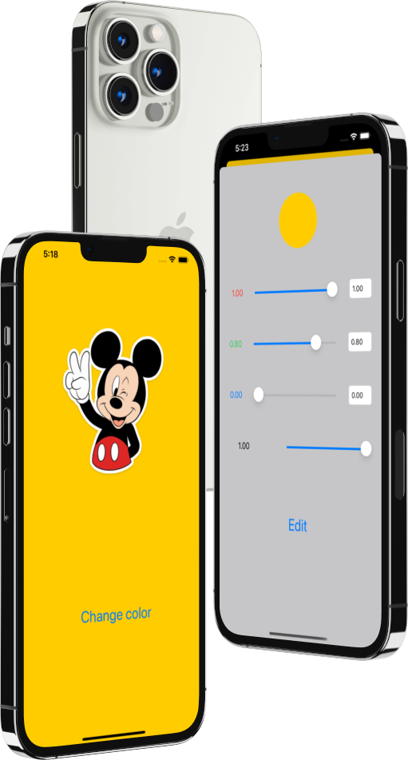

# ColorApplication

## Introduction

Hi, my name is Aleksandr. I'm glad to see you on my [GitHub](https://github.com/AleksandrBasov?tab=repositories).

## Features

The application is developed in Swift language. This is a small application in which you can change the background color.

<h1 align="center">

